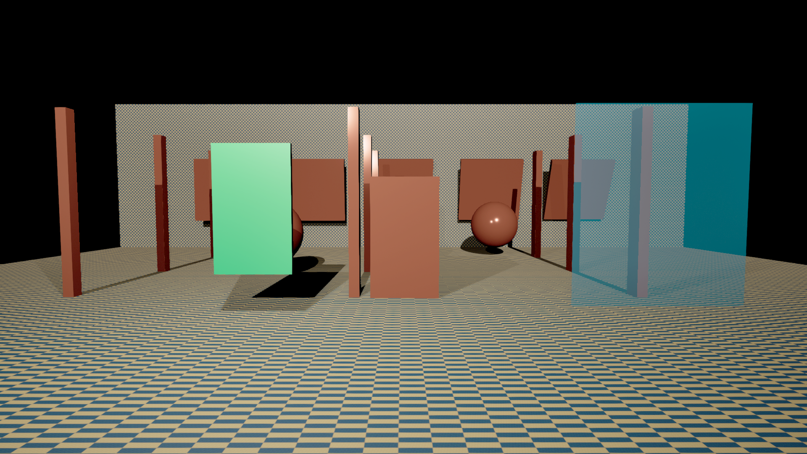

# Deterministic Dataset Capture for Unreal Engine

Capture synchronized engine data for super resolution and frame interpolation: real Main View linear HDR, native HR, frozen-time reference HR, depth, motion, jitter, exposure, matrices, validity masks, and separate scene/UI images.

用于神经超分与插帧的数据采集插件：固定时间重放 → 同步采集 → 检查数据 → 按地图/轨迹划分 → 发布带哈希的索引和训练分片。

**Release status:** development toward 1.0. The current descriptor is 1.0.0-rc.1 while the [formal release checklist](Docs/RELEASE_PLAN.md) is open. The writer, reference accumulation and delivery tools below are implemented; this is not a completed formal-release claim.

## Requirements and installation

- Tested: **UE 5.7.4, Windows, DX12/SM6**. UE 5.8 is a future project target.
- Copy this repository to `<Project>/Plugins/SuperResolutionDataset` in a C++ project, then build its Editor target.
- Offline tools: Python 3.10+ and `python -m pip install -r Scripts/requirements-validation.txt`.
- Asset generation enables PythonScriptPlugin, EditorScriptingUtilities and SequencerScripting.

The module is built for the Windows Editor target (including `UnrealEditor-Cmd -game`); its Niagara and ChaosCaching build dependencies remain required; their specialized cache modes are optional. Acceptance uses Editor/PIE or `UnrealEditor-Cmd -game -RenderOffscreen`. Cooked IoStore games, stereo and split-screen are outside the verified workflow.

## Capture one clip

Copy [the 2× template](Config/job.production-2x.json), set `expectedMap`, `sequence`, the frame range and a new `outputDirectory`. From the plugin directory:

```powershell
.\Scripts\RunDatasetCapture.ps1 `
  -Project "D:\Projects\MyProject\MyProject.uproject" `
  -Editor "D:\UE_5.7\Engine\Binaries\Win64\UnrealEditor-Cmd.exe" `
  -Job "D:\Jobs\my-clip.json" -UseWorkspaceLocalDDC

python Scripts/ValidateDataset.py "D:/Projects/MyProject/Saved/SRDataset/my-clip"
```

`-Map` defaults to `expectedMap`. The runner creates a unique log, supports spaces in paths, checks the engine log and manifest, and reports failure even if Unreal returns zero after a capture error.

Temporal capture requires `NativeRender`, both temporal/Main View options, `frameStep=1`, logical clock/jitter/exposure locking and strict scene-control preflight. Use one full-size viewport. Letterboxing and split-screen cropping are rejected; HR/reference follow the actual player projection and its aspect-ratio policy.

`bResume=false` is the default. Temporal history must start fresh. Batch receipts can reuse completed, unchanged clips. Single-job `bResume=true` supports only fully verified spatial output.

## Native and reference HR

Every temporal clip retains native HR. These additional settings enable a frozen reference:

```json
{
  "bCaptureReferenceHR": true,
  "referenceHRScale": 2,
  "referenceTemporalSamples": 16,
  "referenceResizeFilter": "Lanczos4",
  "bAsyncImageWrites": true,
  "maxPendingImageWriteMB": 512
}
```

Reference counts are **1, 16, 32 or 64**. Multi-sample reference renders keep scene time and exposure fixed, use distinct centered projection offsets, and reset their isolated reference history. Linear RGB is averaged before resizing onto the fixed HR grid. Actual GPU projection/time/exposure and submission IDs are recorded for every sample. These are raster samples, not path-tracing SPP.

For an independent arithmetic audit, use `bSaveReferenceSubsamples=true` and `referenceResizeFilter="Box"`, then run `VerifyReferenceAccumulation.py <dataset> --report <report.json>`. Source-resolution EXRs substantially increase storage and writer memory needs.

Compression and atomic writes run on workers. The budget bounds queued raw image bytes; backpressure waits on the game thread. GPU readback remains synchronous. Only completed files with hashes enter the published manifest; worker errors fail the capture.

## Generated maps, batches and training shards

The asset generator creates original textured gallery, courtyard, workshop and unseen atrium maps using Unreal basic meshes, with lighting, occlusion, transparency, WPO material motion and separate camera trajectories. It does not require the author's private project assets.



The preview is SDR; training color is retained separately as linear HDR EXR. These generated maps validate capture behavior and data delivery.

```powershell
& "D:\UE_5.7\Engine\Binaries\Win64\UnrealEditor-Cmd.exe" `
  "D:\Projects\MyProject\MyProject.uproject" `
  -run=pythonscript -script="D:\Projects\MyProject\Plugins\SuperResolutionDataset\Scripts\GenerateFormalDatasetAssets.py" `
  -EnablePlugins=PythonScriptPlugin,EditorScriptingUtilities,SequencerScripting `
  -unattended -NullRHI -NoSound -ddc=InstalledNoZenLocalFallback

python Scripts/GenerateFormalCapturePlan.py --output Jobs/dataset-v1 --version dataset-v1
python Scripts/RunDatasetBatch.py Jobs/dataset-v1/plan.json `
  --project "D:/Projects/MyProject/MyProject.uproject" `
  --editor "D:/UE_5.7/Engine/Binaries/Win64/UnrealEditor-Cmd.exe" `
  --status Jobs/dataset-v1/status.json --workspace-ddc

python Scripts/DatasetDelivery.py index Jobs/dataset-v1/plan.json `
  --project "D:/Projects/MyProject/MyProject.uproject" --output Delivery/dataset-v1/index.json --purpose temporal-sr
python Scripts/DatasetDelivery.py pack Delivery/dataset-v1/index.json `
  --output Delivery/dataset-v1/shards --samples-per-shard 128 --profile temporal-sr
python Scripts/DatasetDelivery.py verify-shards Delivery/dataset-v1/shards/shards.json
```

The default plan is 30 × 600 frames at 30 fps: **10 minutes**. This is a planned size, not a claim that the full dataset has already been delivered. Use `--frames-per-clip 8` and a new version/output for a smoke test. Every clip has native HR; the first trajectory per map also has multi-sample reference. Three maps supply train and separate validation trajectories; the fourth appears only in test.

Use `--reuse-completed` with the same batch status to verify and skip completed clips. Partial/failed outputs are preserved; recapture into a new output directory.

Large index builds support `--workers 2` (up to 4 independent processes). `--reuse-validation-reports` skips pixel checks only when a passing report still matches the exact manifest and current validator source; it always rechecks every image hash. Start with one worker on memory-constrained machines.

The index command runs validation and binds reports to the manifest and validator source. It refuses failed clips and scene/trajectory split leakage. Its default purpose is `diagnostic`: integrity alone does not certify temporal training. `--purpose temporal-sr` requires `nr-sr-data-v2` and all strict controls and validation gates. The producer marks capture as pending validation; only the admitted index marks these bounded temporal inputs usable for training. Packing rechecks source hashes and publishes `shards.json` only after completion.

Python consumers import `DatasetDelivery.iter_samples(catalog_path, split)`. It yields metadata plus encoded modality bytes, one frame at a time. Preserve clip boundaries and `reset` when constructing temporal windows.

`--profile temporal-sr` packs the contract's HDR inputs/GT, depth, motion, coverage, reactive/transparency and correspondence validity masks, plus object IDs and complete temporal metadata. It checks all master-file hashes while omitting diagnostic previews and duplicate HR variants from the tar. The default `all` profile retains every modality. Keep the master captures for debugging; the sample metadata records their manifest hash and original modality list.

## Data and support boundaries

| Data | Meaning |
|---|---|
| `color_lr_scene_hdr` | Real Main View, AfterDOF/pre-upscale, pre-exposed linear HDR |
| `color_hr_native_scene_hdr` | Isolated, same-time native HR |
| `color_hr_reference_scene_hdr` | Optional frozen-time supersampled reference |
| `motion_full_current_to_previous` | Current → previous, display pixels, +X right/+Y down; geometric motion excludes jitter |
| `depth_device_raw`, `depth_view_linear_meters` | Reversed-Z and view-space meters, with validity and matrices |
| `velocity_raw`, `velocity_coverage` | Engine velocity and actual coverage; camera fallback remains distinguishable |
| `history_rejection_*`, `disocclusion_*` | Jitter-aware correspondence, rejection reason and decision validity |
| `object_id` | Stable component IDs through uint8 Custom Stencil; maximum 255 identities |
| `transparency_mask`, `reactive_mask` | AfterDOF transparency risk; opaque depth/motion do not become transparent-surface ground truth |
| `color_main_view_hudless_after_tonemap`, `ui_color_alpha` | Optional display-size scene and independent premultiplied UI |
| `hr`, `lr`, `depth` | Legacy SDR previews and SceneCapture depth in centimeters; distinct from HDR training fields |

Current/previous matrices, jitter units/phases, pre-exposure, sizes, logical time, cuts and render-submission policies are in `manifest.json`. Sampling previous jittered LR requires converting motion to render pixels and adding previous minus current raster jitter, recovered from the matrices. Use the shipped geometry helpers; NDC jitter and raster offsets do not share every sign convention.

Dynamic same-component self-occlusion is rejected with decision validity zero where surface identity is unproven. Respect validity masks in losses and history reuse. Strict preflight rejects unsupported ticking/random state; an allowlist is an audited exception, not proof that the plugin controls that system. Arbitrary external state, custom Niagara Data Interfaces, full Chaos solver state and unrestricted project WPO are not automatically deterministic.

Use transparency/reactive masks when selecting opaque color and correspondence losses: auxiliary capture and Main View can differ in transparent composition. The [pixel comparison and validator baseline notes](Docs/Validation/README.md) record the measured scope and preserved failures. Deterministic replay can also emit per-frame HDR/depth/motion error images with `VerifyTemporalReplay.py <first> <repeat> --report <report.json> --heatmaps <new-directory>`.

FG uses independent forward endpoint, reverse endpoint and real midpoint processes. Reverse motion is rendered, never constructed by negating forward motion. The producer stays pending or explicitly uncertified; the validator admits a bounded capture contract only after all integrity, project WPO, skeletal and animated-material evidence passes. The report records that scope and preserves unknown-pixel validity limits. See [FG acceptance and evidence commands](Docs/FG_ACCEPTANCE.md).

API details, specialized cache workflows and older evidence remain in [legacy reference](Docs/LEGACY_REFERENCE.md). Prior audit findings and limited temporal acceptance are documented in [temporal acceptance](Docs/TEMPORAL_ACCEPTANCE.md).

## License

[MIT](LICENSE). Unreal Engine and its built-in assets remain subject to Epic's terms.
